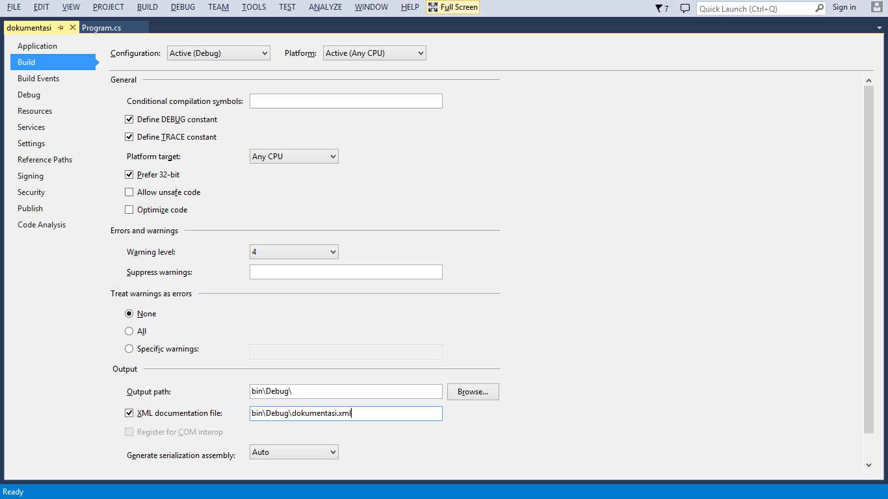

dokumentasi
===========

.NET documentation generator

Note: work in progress

about
-----

dokumentasi is a documentation generator for .NET. It uses XML documentation generated by your project to generate documentation in XML and HTML format.

usage
-----

    dokumentasi.exe assemblyname

This will combine documentation from *assemblyname.xml* with reflection information from *assemblyname.dll* into XML/HTML documentation. 

project settings
----------------

Use the `/doc` compiler option or use the settings tab of your project:

